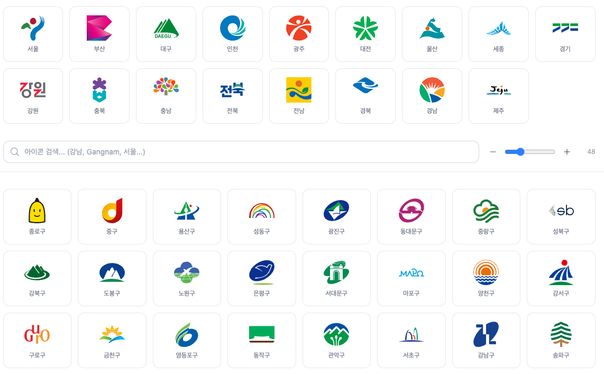

# @apt.today/react-korea-icons

[](https://www.npmjs.com/package/@apt.today/react-korea-icons)
[](https://www.npmjs.com/package/@apt.today/react-korea-icons)
[](https://github.com/myriky/apt-today-react-korea-icons)
[](https://www.typescriptlang.org/)
[](./LICENSE)

대한민국 17개 광역자치단체 CI + 226개 기초자치단체 공식 로고를 React 컴포넌트로 제공합니다.



[데모 페이지](https://myriky.github.io/apt-today-react-korea-icons/)

> 이전 패키지명 `@apt.today/react-seoul-icons`에서 전국 확장에 맞춰 이름을 변경했습니다.

## 설치

```bash
npm install @apt.today/react-korea-icons
```

```bash
yarn add @apt.today/react-korea-icons
```

## 사용법

### 컴포넌트 직접 사용

```tsx
import { GangnamGu, Seoul, Busan, HaeundaeGu } from "@apt.today/react-korea-icons";

function App() {
  return (
    <div>
      <Seoul width={64} height={64} />
      <GangnamGu className="w-12 h-12" />
      <Busan style={{ width: 48, height: 48 }} />
      <HaeundaeGu width={48} height={48} />
    </div>
  );
}
```

### 유틸리티로 동적 조회

코드나 이름으로 아이콘을 동적으로 가져올 때는 `utils`를 사용합니다.

```tsx
import { utils } from "@apt.today/react-korea-icons";

// 코드로 아이콘 가져오기 (시도 2자리 / 시군구 5자리 자동 판별)
const SeoulIcon = utils.getIcon(11);      // 서울특별시
const GangnamIcon = utils.getIcon(11680); // 강남구

// 이름으로 아이콘 검색
const Icon = utils.findByName("강남구");
const Icon2 = utils.findByName("해운대구");

// 중복 이름(중구, 동구 등)은 region 옵션으로 구분
const JungGu = utils.findByName("중구", { region: "서울" });
const BusanDongGu = utils.findByName("동구", { region: "부산" });
```

### 지역별 목록 조회

```tsx
import { utils } from "@apt.today/react-korea-icons";

// 시도별 시군구 목록
const seoulIcons = utils.getByRegion(11);      // 코드로
const busanIcons = utils.getByRegion("부산");   // 이름으로

// 전체 시도 목록 (17개)
const regions = utils.getAllRegions();

// 전체 시군구 아이콘 목록 (210개)
const allIcons = utils.getAll();

function DistrictList() {
  return (
    <div className="grid grid-cols-5 gap-4">
      {busanIcons.map((icon) => (
        <div key={icon.code} className="flex flex-col items-center">
          <icon.component className="w-12 h-12" />
          <span>{icon.name}</span>
        </div>
      ))}
    </div>
  );
}
```

### API 응답에서 동적으로 사용

```tsx
import { utils } from "@apt.today/react-korea-icons";

// 행정구역 코드를 받은 경우
function DistrictIcon({ code }: { code: number }) {
  const Icon = utils.getIcon(code);
  if (!Icon) return null;
  return <Icon width={48} height={48} />;
}
```

## API

### 아이콘 컴포넌트

모든 아이콘 컴포넌트는 `React.SVGProps<SVGSVGElement>`를 지원합니다.

```tsx
<GangnamGu width={48} height={48} />
<GangnamGu className="w-12 h-12" />
<GangnamGu style={{ width: 48 }} />
```

### utils

| 메서드 | 설명 | 반환 타입 |
| --- | --- | --- |
| `utils.getIcon(code)` | 시도/시군구 코드로 아이콘 가져오기 | `IconComponent \| null` |
| `utils.findByName(name, options?)` | 이름으로 아이콘 검색 | `IconComponent \| null` |
| `utils.getInfo(code)` | 코드로 상세 정보 가져오기 | `IconInfo \| RegionInfo \| null` |
| `utils.getByRegion(codeOrName)` | 특정 시도의 시군구 목록 | `IconInfo[]` |
| `utils.getAllRegions()` | 모든 시도 정보 | `RegionInfo[]` |
| `utils.getAvailableRegions()` | 아이콘이 있는 시도만 | `RegionInfo[]` |
| `utils.getRegionsWithIcons()` | 시군구가 있는 시도만 | `RegionInfo[]` |
| `utils.getAll()` | 모든 시군구 아이콘 정보 | `IconInfo[]` |
| `utils.isValid(code)` | 유효한 코드인지 확인 | `boolean` |

### 타입

```tsx
import type { IconComponent, IconInfo, RegionInfo } from "@apt.today/react-korea-icons";

// IconComponent
type IconComponent = React.ComponentType<React.SVGProps<SVGSVGElement>>;

// IconInfo - 시군구 아이콘 정보
interface IconInfo {
  code: number;          // 시군구 코드 (예: 11680)
  regionCode: number;    // 소속 시도 코드 (예: 11)
  regionName: string;    // 소속 시도명 (예: "서울특별시")
  name: string;          // 이름 (예: "강남구")
  shortName: string;     // 단축명 (예: "강남")
  componentName: string; // 컴포넌트명 (예: "GangnamGu")
  component: IconComponent;
}

// RegionInfo - 시도 정보
interface RegionInfo {
  code: number;               // 시도 코드 (예: 11)
  name: string;               // 전체 이름 (예: "서울특별시")
  shortName: string;          // 단축명 (예: "서울")
  englishName: string;        // 영문명 (예: "Seoul")
  component: IconComponent | null;
}
```

## 지원 행정구역

17개 광역자치단체 CI + 226개 기초자치단체 로고

> 행정구역 코드는 [법정동코드](https://www.code.go.kr) 기준입니다.

| 시도 | 코드 | 컴포넌트명 | 시군구 |
| --- | --- | --- | --- |
| 서울특별시 | `11` | `Seoul` | 25개 |
| 부산광역시 | `26` | `Busan` | 16개 |
| 대구광역시 | `27` | `Daegu` | 9개 |
| 인천광역시 | `28` | `Incheon` | 10개 |
| 광주광역시 | `29` | `Gwangju` | 5개 |
| 대전광역시 | `30` | `Daejeon` | 5개 |
| 울산광역시 | `31` | `Ulsan` | 5개 |
| 세종특별자치시 | `36` | `Sejong` | - |
| 경기도 | `41` | `Gyeonggi` | 31개 |
| 강원특별자치도 | `51` | `Gangwon` | 18개 |
| 충청북도 | `43` | `Chungbuk` | 11개 |
| 충청남도 | `44` | `Chungnam` | 15개 |
| 전북특별자치도 | `52` | `Jeonbuk` | 14개 |
| 전라남도 | `46` | `Jeonnam` | 22개 |
| 경상북도 | `47` | `Gyeongbuk` | 22개 |
| 경상남도 | `48` | `Gyeongnam` | 18개 |
| 제주특별자치도 | `50` | `Jeju` | - |

### 시군구 상세 코드

<details>
<summary><strong>서울특별시</strong> (코드: 11) — 25개</summary>

| 코드 | 이름 | 컴포넌트명 |
| --- | --- | --- |
| `11110` | 종로구 | `JongnoGu` |
| `11140` | 중구 | `JungGu` |
| `11170` | 용산구 | `YongsanGu` |
| `11200` | 성동구 | `SeongdongGu` |
| `11215` | 광진구 | `GwangjinGu` |
| `11230` | 동대문구 | `DongdaemunGu` |
| `11260` | 중랑구 | `JungnangGu` |
| `11290` | 성북구 | `SeongbukGu` |
| `11305` | 강북구 | `GangbukGu` |
| `11320` | 도봉구 | `DobongGu` |
| `11350` | 노원구 | `NowonGu` |
| `11380` | 은평구 | `EunpyeongGu` |
| `11410` | 서대문구 | `SeodaemunGu` |
| `11440` | 마포구 | `MapoGu` |
| `11470` | 양천구 | `YangcheonGu` |
| `11500` | 강서구 | `GangseoGu` |
| `11530` | 구로구 | `GuroGu` |
| `11545` | 금천구 | `GeumcheonGu` |
| `11560` | 영등포구 | `YeongdeungpoGu` |
| `11590` | 동작구 | `DongjakGu` |
| `11620` | 관악구 | `GwanakGu` |
| `11650` | 서초구 | `SeochoGu` |
| `11680` | 강남구 | `GangnamGu` |
| `11710` | 송파구 | `SongpaGu` |
| `11740` | 강동구 | `GangdongGu` |

</details>

<details>
<summary><strong>부산광역시</strong> (코드: 26) — 16개</summary>

| 코드 | 이름 | 컴포넌트명 |
| --- | --- | --- |
| `26110` | 중구 | `BusanJungGu` |
| `26140` | 서구 | `BusanSeoGu` |
| `26170` | 동구 | `BusanDongGu` |
| `26200` | 영도구 | `YeongdoGu` |
| `26230` | 부산진구 | `BusanjinGu` |
| `26260` | 동래구 | `DongnaeGu` |
| `26290` | 남구 | `BusanNamGu` |
| `26320` | 북구 | `BusanBukGu` |
| `26350` | 해운대구 | `HaeundaeGu` |
| `26380` | 사하구 | `SahaGu` |
| `26410` | 금정구 | `GeumjeongGu` |
| `26440` | 강서구 | `BusanGangseoGu` |
| `26470` | 연제구 | `YeonjeGu` |
| `26500` | 수영구 | `SuyeongGu` |
| `26530` | 사상구 | `SasangGu` |
| `26710` | 기장군 | `GijangGun` |

</details>

<details>
<summary><strong>대구광역시</strong> (코드: 27) — 9개</summary>

| 코드 | 이름 | 컴포넌트명 |
| --- | --- | --- |
| `27110` | 중구 | `DaeguJungGu` |
| `27140` | 동구 | `DaeguDongGu` |
| `27170` | 서구 | `DaeguSeoGu` |
| `27200` | 남구 | `DaeguNamGu` |
| `27230` | 북구 | `DaeguBukGu` |
| `27260` | 수성구 | `SuseongGu` |
| `27290` | 달서구 | `DalseoGu` |
| `27710` | 달성군 | `DalseongGun` |
| `27720` | 군위군 | `GunwiGun` |

</details>

<details>
<summary><strong>인천광역시</strong> (코드: 28) — 10개</summary>

| 코드 | 이름 | 컴포넌트명 |
| --- | --- | --- |
| `28110` | 중구 | `IncheonJungGu` |
| `28140` | 동구 | `IncheonDongGu` |
| `28177` | 미추홀구 | `MichuholGu` |
| `28185` | 연수구 | `YeonsuGu` |
| `28200` | 남동구 | `NamdongGu` |
| `28237` | 부평구 | `BupyeongGu` |
| `28245` | 계양구 | `GeyangGu` |
| `28260` | 서구 | `IncheonSeoGu` |
| `28710` | 강화군 | `GanghwaGun` |
| `28720` | 옹진군 | `OngjinGun` |

</details>

<details>
<summary><strong>광주광역시</strong> (코드: 29) — 5개</summary>

| 코드 | 이름 | 컴포넌트명 |
| --- | --- | --- |
| `29110` | 동구 | `GwangjuDongGu` |
| `29140` | 서구 | `GwangjuSeoGu` |
| `29155` | 남구 | `GwangjuNamGu` |
| `29170` | 북구 | `GwangjuBukGu` |
| `29200` | 광산구 | `GwangsanGu` |

</details>

<details>
<summary><strong>대전광역시</strong> (코드: 30) — 5개</summary>

| 코드 | 이름 | 컴포넌트명 |
| --- | --- | --- |
| `30110` | 동구 | `DaejeonDongGu` |
| `30140` | 중구 | `DaejeonJungGu` |
| `30170` | 서구 | `DaejeonSeoGu` |
| `30200` | 유성구 | `YuseongGu` |
| `30230` | 대덕구 | `DaedeokGu` |

</details>

<details>
<summary><strong>울산광역시</strong> (코드: 31) — 5개</summary>

| 코드 | 이름 | 컴포넌트명 |
| --- | --- | --- |
| `31110` | 중구 | `UlsanJungGu` |
| `31140` | 남구 | `UlsanNamGu` |
| `31170` | 동구 | `UlsanDongGu` |
| `31200` | 북구 | `UlsanBukGu` |
| `31710` | 울주군 | `UlsanUljuGun` |

</details>

<details>
<summary><strong>경기도</strong> (코드: 41) — 31개</summary>

| 코드 | 이름 | 컴포넌트명 |
| --- | --- | --- |
| `41110` | 수원시 | `SuwonSi` |
| `41130` | 성남시 | `SeongnamSi` |
| `41150` | 의정부시 | `UijeongbuSi` |
| `41170` | 안양시 | `AnyangSi` |
| `41190` | 부천시 | `BucheonSi` |
| `41210` | 광명시 | `GwangmyeongSi` |
| `41220` | 평택시 | `PyeongtaekSi` |
| `41250` | 동두천시 | `DongducheonSi` |
| `41270` | 안산시 | `AnsanSi` |
| `41280` | 고양시 | `GoyangSi` |
| `41290` | 과천시 | `GwacheonSi` |
| `41310` | 구리시 | `GuriSi` |
| `41360` | 남양주시 | `NamyangjuSi` |
| `41370` | 오산시 | `OsanSi` |
| `41390` | 시흥시 | `SiheungSi` |
| `41410` | 군포시 | `GunpoSi` |
| `41430` | 의왕시 | `UiwangSi` |
| `41450` | 하남시 | `HanamSi` |
| `41460` | 용인시 | `YonginSi` |
| `41480` | 파주시 | `PajuSi` |
| `41500` | 이천시 | `IcheonSi` |
| `41550` | 안성시 | `AnseongSi` |
| `41570` | 김포시 | `GimpoSi` |
| `41590` | 화성시 | `HwaseongSi` |
| `41610` | 광주시 | `GyeonggiGwangjuSi` |
| `41630` | 양주시 | `YangjuSi` |
| `41650` | 포천시 | `PocheonSi` |
| `41670` | 여주시 | `YeojuSi` |
| `41800` | 연천군 | `YeoncheonGun` |
| `41820` | 가평군 | `GapyeongGun` |
| `41830` | 양평군 | `YangpyeongGun` |

</details>

<details>
<summary><strong>강원특별자치도</strong> (코드: 51) — 18개</summary>

| 코드 | 이름 | 컴포넌트명 |
| --- | --- | --- |
| `51110` | 춘천시 | `ChuncheonSi` |
| `51130` | 원주시 | `WonjuSi` |
| `51150` | 강릉시 | `GangneungSi` |
| `51170` | 동해시 | `DonghaeSi` |
| `51190` | 태백시 | `TaebaekSi` |
| `51210` | 속초시 | `SokcheoSi` |
| `51230` | 삼척시 | `SamcheokSi` |
| `51720` | 홍천군 | `HongcheonGun` |
| `51730` | 횡성군 | `HoengseongGun` |
| `51750` | 영월군 | `YeongwolGun` |
| `51760` | 평창군 | `PyeongchangGun` |
| `51770` | 정선군 | `JeongseonGun` |
| `51780` | 철원군 | `CheorwonGun` |
| `51790` | 화천군 | `HwacheonGun` |
| `51800` | 양구군 | `YanguGun` |
| `51810` | 인제군 | `InjeGun` |
| `51820` | 고성군 | `GangwonGoseongGun` |
| `51830` | 양양군 | `YangyangGun` |

</details>

<details>
<summary><strong>충청북도</strong> (코드: 43) — 11개</summary>

| 코드 | 이름 | 컴포넌트명 |
| --- | --- | --- |
| `43110` | 청주시 | `CheongjuSi` |
| `43130` | 충주시 | `ChungjuSi` |
| `43150` | 제천시 | `JecheonSi` |
| `43720` | 보은군 | `BoeunGun` |
| `43730` | 옥천군 | `OkcheonGun` |
| `43740` | 영동군 | `YeongdongGun` |
| `43745` | 증평군 | `JeungpyeongGun` |
| `43750` | 진천군 | `JincheonGun` |
| `43760` | 괴산군 | `GoesanGun` |
| `43770` | 음성군 | `EumseongGun` |
| `43800` | 단양군 | `DanyangGun` |

</details>

<details>
<summary><strong>충청남도</strong> (코드: 44) — 15개</summary>

| 코드 | 이름 | 컴포넌트명 |
| --- | --- | --- |
| `44130` | 천안시 | `CheonanSi` |
| `44150` | 공주시 | `GongjuSi` |
| `44180` | 보령시 | `BoryeongSi` |
| `44200` | 아산시 | `AsanSi` |
| `44210` | 서산시 | `SeosanSi` |
| `44230` | 논산시 | `NonsanSi` |
| `44250` | 계룡시 | `GyeryongSi` |
| `44270` | 당진시 | `DangjinSi` |
| `44710` | 금산군 | `GeumsanGun` |
| `44760` | 부여군 | `BuyeoGun` |
| `44770` | 서천군 | `SeocheonGun` |
| `44790` | 청양군 | `CheongyangGun` |
| `44800` | 홍성군 | `HongseongGun` |
| `44810` | 예산군 | `YesanGun` |
| `44825` | 태안군 | `TaeanGun` |

</details>

<details>
<summary><strong>전북특별자치도</strong> (코드: 52) — 14개</summary>

| 코드 | 이름 | 컴포넌트명 |
| --- | --- | --- |
| `52110` | 전주시 | `JeonjuSi` |
| `52130` | 군산시 | `GunsanSi` |
| `52140` | 익산시 | `IksanSi` |
| `52180` | 정읍시 | `JeongeupSi` |
| `52190` | 남원시 | `NamwonSi` |
| `52210` | 김제시 | `GimjeSi` |
| `52710` | 완주군 | `WanjuGun` |
| `52720` | 진안군 | `JinanGun` |
| `52730` | 무주군 | `MujuGun` |
| `52740` | 장수군 | `JangsuGun` |
| `52750` | 임실군 | `ImsilGun` |
| `52770` | 순창군 | `SunchangGun` |
| `52790` | 고창군 | `GochangGun` |
| `52800` | 부안군 | `BuanGun` |

</details>

<details>
<summary><strong>전라남도</strong> (코드: 46) — 22개</summary>

| 코드 | 이름 | 컴포넌트명 |
| --- | --- | --- |
| `46110` | 목포시 | `MokpoSi` |
| `46130` | 여수시 | `YeosuSi` |
| `46150` | 순천시 | `SuncheonSi` |
| `46170` | 나주시 | `NajuSi` |
| `46230` | 광양시 | `GwangyangSi` |
| `46710` | 담양군 | `DamyangGun` |
| `46720` | 곡성군 | `GokseongGun` |
| `46730` | 구례군 | `GuryeGun` |
| `46770` | 고흥군 | `GoheungGun` |
| `46780` | 보성군 | `BoseongGun` |
| `46790` | 화순군 | `HwasunGun` |
| `46800` | 장흥군 | `JangheungGun` |
| `46810` | 강진군 | `GangjinGun` |
| `46820` | 해남군 | `HaenamGun` |
| `46830` | 영암군 | `YeongamGun` |
| `46840` | 무안군 | `MuanGun` |
| `46860` | 함평군 | `HampyeongGun` |
| `46870` | 영광군 | `YeonggwangGun` |
| `46880` | 장성군 | `JangseongGun` |
| `46890` | 완도군 | `WandoGun` |
| `46900` | 진도군 | `JindoGun` |
| `46910` | 신안군 | `SinanGun` |

</details>

<details>
<summary><strong>경상북도</strong> (코드: 47) — 22개</summary>

| 코드 | 이름 | 컴포넌트명 |
| --- | --- | --- |
| `47110` | 포항시 | `PohangSi` |
| `47130` | 경주시 | `GyeongjuSi` |
| `47150` | 김천시 | `GimcheonSi` |
| `47170` | 안동시 | `AndongSi` |
| `47190` | 구미시 | `GumiSi` |
| `47210` | 영주시 | `YeongjuSi` |
| `47230` | 영천시 | `YeongcheonSi` |
| `47250` | 상주시 | `SangjuSi` |
| `47280` | 문경시 | `MungyeongSi` |
| `47290` | 경산시 | `GyeongsanSi` |
| `47730` | 의성군 | `UiseongGun` |
| `47750` | 청송군 | `CheongsongGun` |
| `47760` | 영양군 | `YeongyangGun` |
| `47770` | 영덕군 | `YeongdeokGun` |
| `47820` | 청도군 | `CheongdoGun` |
| `47830` | 고령군 | `GoryeongGun` |
| `47840` | 성주군 | `SeongjuGun` |
| `47850` | 칠곡군 | `ChilgokGun` |
| `47900` | 예천군 | `YecheonGun` |
| `47920` | 봉화군 | `BonghwaGun` |
| `47930` | 울진군 | `UljinGun` |
| `47940` | 울릉군 | `UlleungGun` |

</details>

<details>
<summary><strong>경상남도</strong> (코드: 48) — 18개</summary>

| 코드 | 이름 | 컴포넌트명 |
| --- | --- | --- |
| `48120` | 창원시 | `ChangwonSi` |
| `48170` | 진주시 | `JinjuSi` |
| `48220` | 통영시 | `TongyeongSi` |
| `48240` | 사천시 | `SacheonSi` |
| `48250` | 김해시 | `GimhaeSi` |
| `48270` | 밀양시 | `MiryangSi` |
| `48310` | 거제시 | `GeojeSi` |
| `48330` | 양산시 | `YangsanSi` |
| `48720` | 의령군 | `UiryeongGun` |
| `48730` | 함안군 | `HamanGun` |
| `48740` | 창녕군 | `ChangnyeongGun` |
| `48820` | 고성군 | `GyeongnamGoseongGun` |
| `48840` | 남해군 | `NamhaeGun` |
| `48850` | 하동군 | `HadongGun` |
| `48860` | 산청군 | `SancheongGun` |
| `48870` | 함양군 | `HamyangGun` |
| `48880` | 거창군 | `GeochangGun` |
| `48890` | 합천군 | `HapcheonGun` |

</details>

## react-seoul-icons에서 마이그레이션

패키지명만 변경하면 됩니다. API는 동일합니다.

```diff
- import { GangnamGu, utils } from "@apt.today/react-seoul-icons";
+ import { GangnamGu, utils } from "@apt.today/react-korea-icons";
```

## 라이선스

### 아이콘 저작권

본 라이브러리의 아이콘은 각 지방자치단체의 공식 심볼/로고로, 공공누리 제1유형(출처표시)에 따라 자유롭게 이용할 수 있습니다.

### 라이브러리 코드

MIT 라이선스. 자세한 내용은 [LICENSE](./LICENSE) 파일을 참고하세요.

## About apt.today

이 라이브러리는 [apt.today](https://apt.today) 프로젝트의 일부입니다.

**apt.today**는 전국 지자체별 고시공고문, 모집공고문, 토지거래허가내역을 비롯한 다양한 아파트 관련 정보를 제공하는 플랫폼입니다.

## 기여

이슈 제보 및 풀 리퀘스트는 언제나 환영합니다!
